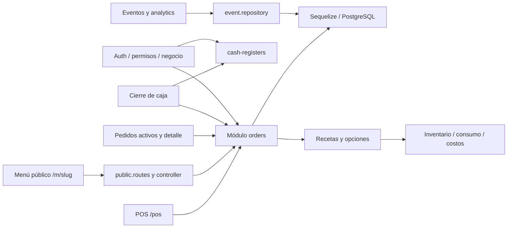

# Mapa de Operfoods y uso de Graphify

Fecha de revisión manual: 2026-10-02. Grafo automático original: 2026-10-01, 1.979 nodos, 4.487 aristas y 125 comunidades. Contiene Operfoods y casinos: filtrar por rutas antes de usarlo para decidir cambios. Un vínculo inferido no demuestra una integración en ejecución.

[Visualización interactiva](../../graphify-out/graph.html) · [Reporte](../../graphify-out/GRAPH_REPORT.md) · [Datos](../../graphify-out/graph.json).

## Verificación realizada el 2026-10-02

Se ejecutaron `graphify query "Orders Cost Repositories" --budget 1300` y `graphify diagnose multigraph --max-examples 2`. La consulta localizó repositorio/servicio de pedidos, cálculo de costos, controlador público y contexto operativo; encontró 190 nodos y mostró 35 por límite de salida. El diagnóstico confirmó 1.979 nodos y 4.487 aristas válidas, sin endpoints faltantes ni duplicados exactos. Esto verifica integridad estructural del archivo, no corrección del producto ni ausencia de pérdidas previas a la construcción del grafo.

Se conserva el grafo original sin regenerarlo: no hubo cambios de código y su extracción no representa aún los nuevos documentos. El mapa y la tabla de tareas de este archivo vinculan explícitamente la planificación con ese grafo.

## Flujo actual observado



Este mapa muestra dependencias funcionales revisadas manualmente, no un call graph generado ni certificación de autorización correcta. Flujo pendiente: actualizar cola periódicamente → alertar → cocina → comanda → entrega; completar márgenes con costos históricos.

## Rutas de navegación para las tareas

| Tareas | Entradas frontend | Entradas backend/datos |
|---|---|---|
| T20 aislamiento | `src/lib/auth.ts`, contexto operativo | `shared/middlewares/`, `orders/order.routes.ts`, `events/event.repository.ts` |
| T21–T23 consistencia | `/pos`, `/m/[slug]`, `/pos/cierre-caja` | `orders/order.repository.ts`, `Order`, `OrderItem`, `Payment`, `CashMovement` |
| T30–T34 cola/cocina | `/pos/pedidos-activos`, detalle, `lib/services.ts` | `orders` controlador/servicio/repositorio |
| T40 impresión | POS y detalle de pedido | Snapshot del pedido; futura integración de hardware |
| T41–T43 móvil/demo | `/pos`, menú, layout/navigation | Productos, opciones, negocios, usuarios; seed propuesto |
| T60–T63 margen | `/events/analytics`, cierre y futuro reporte | `calculateItemCost`, recetas, inventario, `OrderItem.cost`, eventos/gastos |

Todas las rutas frontend se resuelven bajo `app-frontend/`; backend bajo `app-backend/src/`. Nombres de tareas provienen de [PLAN.md](PLAN.md).

## Hallazgos que hay que comprobar

- Las lecturas iniciales de `order.routes.ts` aparecen antes de `router.use(authenticate)`. Revisar middleware superior y consultas; bloquear fuga de datos privados.
- `getAnalytics` obtiene ventas agrupadas por evento sin filtrar negocio en la consulta inicial y filtra eventos después. Comprobar/corregir alcance de toda la agregación.
- Gastos de evento requieren validación de propiedad del evento; no basta recibir `businessId` y no utilizarlo.
- `getSummary` y `getAnalytics` calculan margen restando gastos a ventas; no incorporan automáticamente el costo de las líneas.
- El cálculo de costo recibe cantidad del pedido: evitar volver a multiplicar al agregar reportes.
- Etiquetas/origen `WHATSAPP` no prueban consumo de API de WhatsApp. Opciones de pasarela tampoco prueban cobro integrado.
- El grafo mezcla `sequelize` y componentes de dos sistemas; comprobar `source_file` antes de seguir una arista.

## Consultas reproducibles

Desde la raíz, con Graphify instalado:

```powershell
graphify query "Orders Cost Repositories" --budget 2000
graphify explain "calculateItemCost"
graphify affected "OrderItem" --depth 2
graphify query "Cash Register Closeout" --budget 2000
graphify query "Public Menu Orders" --budget 2000
graphify diagnose multigraph --max-examples 3
```

Si un nombre no coincide, buscar el símbolo real en `graph.json` o usar `rg` en el código. El grafo ayuda a navegar; la fuente y las pruebas deciden.

## Actualización al retomar

Preservar el grafo original antes de regenerar. `graphify update . --no-cluster` reextrae código sin LLM; no garantiza extracción semántica de estos nuevos Markdown. Puede rechazar una reducción de nodos: inspeccionar el resultado, no usar `--force` automáticamente. `graphify cluster-only . --no-label` recompone reporte/visualización sin solicitar nombres mediante LLM. Comprobar fechas y conteos, y registrar qué corpus quedó incluido.

Estos documentos y el mapa manual son el complemento de producto del Graphify existente; no inventar aristas EXTRACTED para requisitos futuros. Si se añade grafo de planificación, mantenerlo separado del grafo de código y marcarlo como propuesto.
